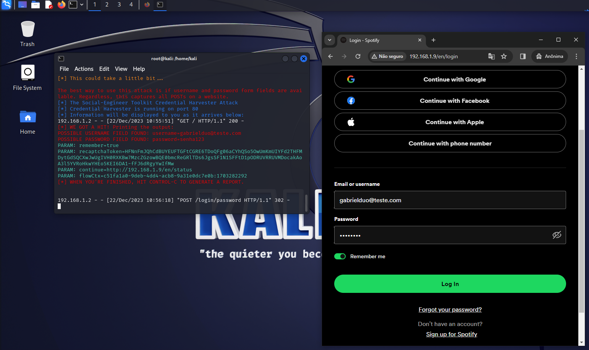

# Phishing para captura de senhas do Spotify

>Desafio de Phishing do Santander Bootcamp Cibersegurança:
>Utiliza Kali Linux e setoolkit para simular um ataque de phishing com um template 
>do Spotify, visando entender técnicas de cibersegurança.

### Ferramentas

- Kali Linux
- setoolkit

### Configurando o Phishing no Kali Linux

- Acesso root: ``` sudo su ```
- Iniciando o setoolkit: ``` setoolkit ```
- Tipo de ataque: ``` Social-Engineering Attacks ```
- Vetor de ataque: ``` Web Site Attack Vectors ```
- Método de ataque: ```Credential Harvester Attack Method ```
- Método de ataque: ``` Site Cloner ```
- Obtendo o endereço da máquina: ``` ifconfig ```
- URL para clone: http://accounts.spotify.com/en/login

### Resutados


